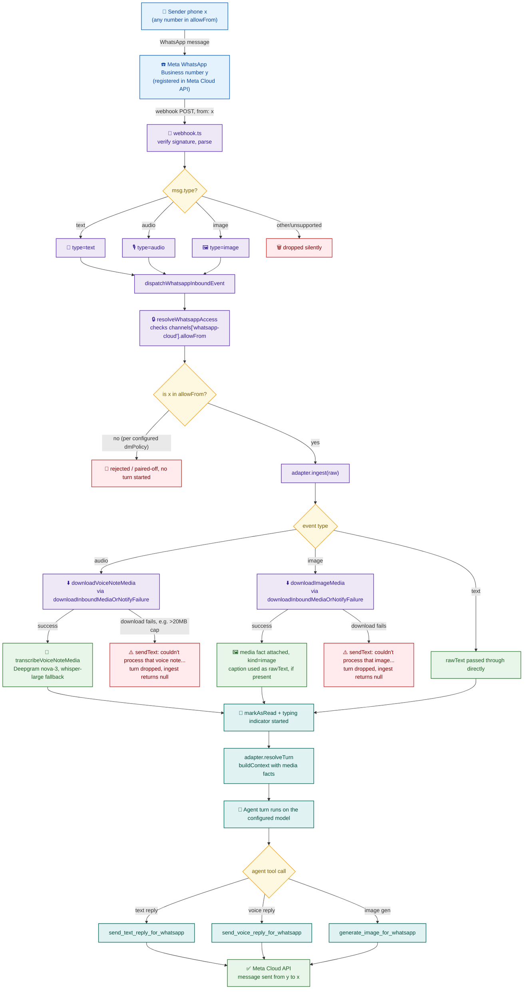
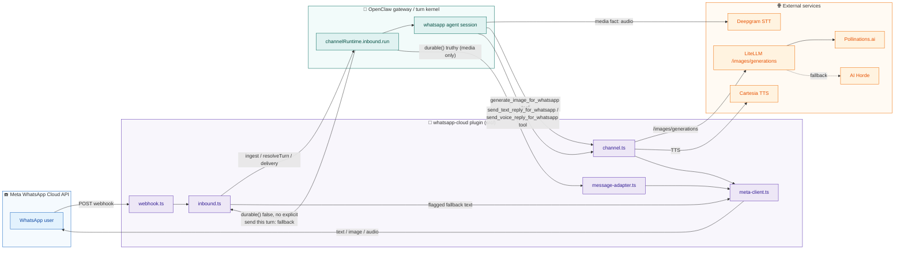
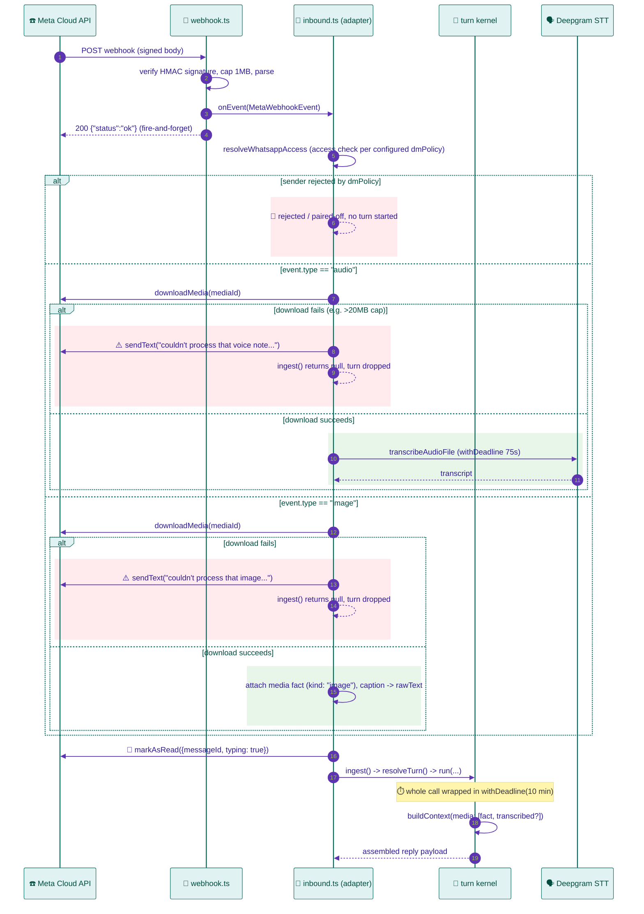
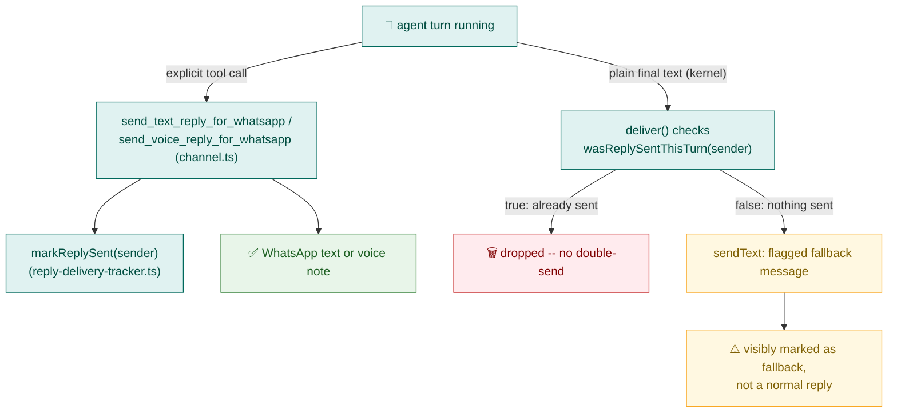
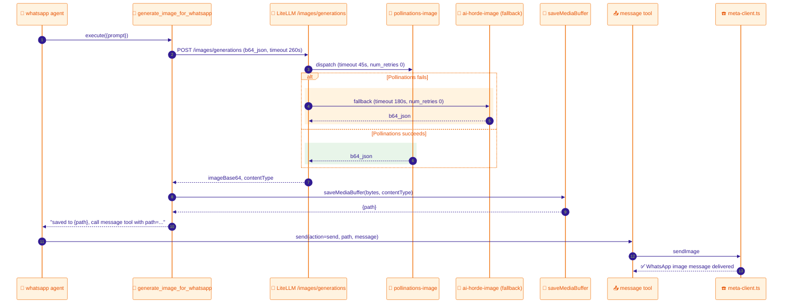
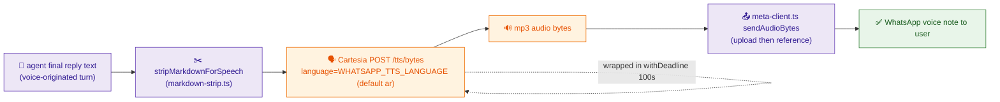

# WhatsApp Cloud Plugin — Architecture

This document describes the current, as-built architecture of
`openclaw/plugins/whatsapp-cloud/`, the OpenClaw channel plugin that connects
your OpenClaw agents to Meta's WhatsApp Business Cloud API. It reflects the
code as it exists today, after several rounds of production incidents and
fixes — not the original design. File and function references throughout
point at the real source under this plugin's `src/` directory unless noted
otherwise.

## 1. Overview

`whatsapp-cloud` is a genuine, registered OpenClaw **channel plugin** — not a
standalone service that talks to OpenClaw over some side channel. It is
installed into the `openclaw` gateway container via `openclaw plugins install
--link` (see §6) and participates in the framework's own channel-plugin
contract: `channel.ts` builds a `ChannelPlugin` via
`createChatChannelPlugin`, `index.ts` wires it into the gateway's full
runtime (`defineChannelPluginEntry`), and `setup-entry.ts` wires it into the
CLI's setup/onboarding flow (`defineSetupPluginEntry`).

It supports three message modalities on a single WhatsApp number:

- **Text** — plain back-and-forth conversation.
- **Image generation** — the agent can generate and send an image, via a
  dedicated tool backed by LiteLLM's `/images/generations` endpoint.
- **Voice notes** — inbound voice notes are transcribed and handled like
  text; the agent explicitly chooses text or voice for its reply per turn
  (defaulting to mirroring the input type), via two dedicated tools — see
  §2.4.

**Design philosophy: replaces an external-bridge architecture.** This plugin
replaces a previous, now fully-deleted `whatsapp-bridge/` — a standalone
Python FastAPI service that spoke to WhatsApp directly and called into
OpenClaw's agent session over its own client (`whatsapp-bridge/claw_client.py`,
`whatsapp-bridge/app.py`, `whatsapp-bridge/speech.py`, etc., all deleted).
That architecture kept WhatsApp's webhook handling, session management, and
delivery entirely outside OpenClaw's own turn kernel, which meant WhatsApp
conversations didn't get OpenClaw's native session semantics, access-control
gates, or delivery machinery for free — the bridge had to reimplement them.
The current plugin instead runs *inside* the OpenClaw gateway process and
drives the framework's own turn kernel directly
(`inbound.ts`'s `dispatchWhatsappInboundEvent` calls
`channelRuntime.inbound.run(...)`), so WhatsApp gets the same session
persistence, access control, and reply-delivery infrastructure every other
first-class channel (SMS, the bundled `whatsapp` extension, etc.) gets, with
this plugin only supplying the WhatsApp-specific adapters (webhook handling,
Meta Graph API calls, voice codec glue). Several of the STT/TTS/audio
behaviors below are deliberately ported from the old bridge's proven
behavior (e.g. voice-in-voice-out symmetry, Deepgram STT wiring) even though
the transport around them changed completely.

### 1.1 End-to-end example: one message, start to finish

### 1.2 System overview

## 2. Inbound flow

### 2.1 Webhook receipt and signature verification

`webhook.ts`'s `createMetaWebhookHandler` is a raw Node HTTP handler
registered by `channel.ts`'s `registerFull` at `/whatsapp-cloud/webhook` via
`api.registerHttpRoute(...)` (see §6 for why that specific API call matters).

- `GET` requests handle Meta's webhook-verification handshake
  (`hub.mode=subscribe`, `hub.verify_token`, `hub.challenge`), comparing the
  token with `constantTimeStringEqual` (a `timingSafeEqual` wrapper) against
  `WHATSAPP_VERIFY_TOKEN`.
- `POST` requests are the actual event delivery. The body is read with a
  hard 1MB cap (`MAX_BODY_BYTES`, `PayloadTooLargeError` → HTTP 413) before
  any parsing, then its `X-Hub-Signature-256` header is verified via
  `signature.ts`'s `verifyMetaSignature` — an HMAC-SHA256 over the raw body
  using `WHATSAPP_APP_SECRET`, compared with `timingSafeEqual`. Only after
  signature verification does the handler `JSON.parse` the body.
- `parseMetaWebhookPayload` extracts one `MetaWebhookEvent` per inbound
  message (`type: "text" | "audio" | "image"`), dropping anything else
  (reactions, status callbacks, unknown message types) silently.
- Each parsed event is handed synchronously to `onEvent`, which in
  `registerFull` is a `void`-fired call into `dispatchWhatsappInboundEvent`
  (§2.2) — the webhook responds `200 {"status":"ok"}` immediately without
  waiting for the agent turn to finish.

### 2.2 Turn-kernel dispatch — `inbound.ts`'s `dispatchWhatsappInboundEvent`

This is the plugin's core: it adapts a single `MetaWebhookEvent` into
OpenClaw's turn-kernel contract (`channelRuntime.inbound.run(...)`) via an
`ingest` / `resolveTurn` / `delivery` adapter object.

**Session key scheme.** `sessionKeyFor(sender)` produces
`agent:whatsapp:<digits>` — a per-sender session under the fixed
`AGENT_ID = "whatsapp"` agent (the `whatsapp` agent entry in
`openclaw/config/openclaw.base.json`, with its own dedicated
`~/.openclaw/workspace-whatsapp` workspace, distinct from the `main` agent's
workspace). Senders are validated by `SENDER_PATTERN` (`/^\+?\d+$/`) before
use.

**Access control.** `resolveWhatsappAccess` calls the SDK's shared
`resolveStableChannelMessageIngress` (the same helper the bundled
`extensions/sms` reference plugin uses), passing through
`cfg.channels["whatsapp-cloud"].dmPolicy`/`allowFrom`. The plugin then
enforces the resulting `senderAccess.allowed` decision itself, *before* ever
calling into the turn kernel — the code comment is explicit about why this
matters: Meta's test-tier WhatsApp numbers only allow pre-approved test
recipients to message at all, which masks the fact that a
production-verified Meta number has no equivalent gate, so this plugin
cannot rely on Meta to filter senders. `cfg.channels["whatsapp-cloud"].allowFrom`
entries are bare E.164-without-`+` digit strings (see
`openclaw/config/openclaw.base.json`'s `channels.whatsapp-cloud.allowFrom`);
`stripLeadingPlus` normalizes senders before matching.

**`dmPolicy` is a deployment choice, not a hard-coded restriction.** The SDK
(`dm-policy-shared.ts`) supports four modes, and this plugin doesn't assume
any one of them — a deployment picks the mode that fits its use case:

- `"allowlist"` — only senders in `allowFrom` get through. Right for a
  personal bot restricted to specific numbers.
- `"open"` — anyone can message in (`allowFrom: ["*"]`), or an allowlist
  still layers on top if `allowFrom` is set without `"*"`. This is the mode
  for a genuinely public bot, and what this repo's own reference deployment
  (`openclaw/config/openclaw.base.json` in `claw-infra`) uses as of
  2026-07-20, after starting out on `"allowlist"` restricted to a single
  verified number.
- `"pairing"` — new senders go through a self-service pairing flow instead
  of the operator pre-approving every number; a public-but-not-anonymous
  middle ground.
- `"disabled"` — no DMs accepted at all.

Anyone reusing this plugin for a public-facing bot sets `dmPolicy: "open"`
(or `"pairing"`) instead of `"allowlist"` — no plugin code changes needed;
`resolveWhatsappAccess` already routes through all four modes via the same
shared SDK helper.

**The `ingest` / `resolveTurn` / `delivery` adapter shape.** OpenClaw's turn
kernel `await`s `adapter.ingest(raw)` first, then calls `resolveTurn(input)`
to build session/context state, then dispatches the reply through
`delivery`. This plugin's `ingest`:

- For `type: "text"` events, returns the text verbatim as
  `rawText`/`textForAgent`/`textForCommands`.
- For `type: "audio"` events, downloads the voice note (§2.3) and
  transcribes it *synchronously inside `ingest`* before returning, so the
  agent's prompt is built from real transcribed text — see §2.4 for why this
  step exists and is time-bounded.
- For `type: "image"` events, downloads the image (§2.3) and attaches it as
  a native `media` fact; any caption becomes `rawText`.
- Any other/unrecognized event shape returns `null`, which the kernel treats
  as a cleanly-dropped turn (no crash, no fabricated text).
- **Download failures are caught inside `ingest`, not left to propagate.**
  Both the audio and image branches route their download call through
  `downloadInboundMediaOrNotifyFailure`, which on a thrown error (e.g.
  `meta-client.ts`'s `MAX_MEDIA_DOWNLOAD_BYTES` 20MB cap rejecting an
  oversized file — confirmed live with a real 41MB voice note) logs a
  warning, sends the sender a plain-text "couldn't process that
  voice note/image" reply, and returns `null` to drop the turn cleanly.
  Before this existed, the exception surfaced nowhere: no reply, no typing
  indicator, total silence from the bot's side while Meta itself showed the
  message as delivered.

`resolveTurn` builds the kernel's native inbound context via
`channelRuntime.inbound.buildContext(...)`, including the native `media`
attachment mechanism: for a voice note, `input.media` is set to an
`InboundMediaFact[]` (a `{path, contentType, kind: "audio", messageId,
transcribed}` object) referencing the locally-saved audio file. This is how
OpenClaw's own turn kernel (`applyMediaUnderstandingIfNeeded`) knows to
run — or skip — its own post-hoc transcription pass over the same
attachment; `transcribed: true` is only set once `ingest` already obtained a
real transcript, so the framework doesn't pay for (and doesn't
overwrite `Body` with) a redundant second Deepgram call.

### 2.3 Text vs. image vs. audio handling differences

- **Text**: no download/transcription step; `rawText` flows straight from
  the webhook payload into the turn.
- **Audio** (voice notes) and **inbound image** both download via the same
  generic helper, `channel.ts`'s `downloadWhatsappCloudInboundMedia` (wired
  in `inbound.ts` as `downloadVoiceNoteMedia`/`downloadImageMedia`
  respectively) — it downloads the bytes from Meta via `meta-client.ts`'s
  `downloadMedia` and saves them to the sandboxed managed-media directory
  via `saveMediaBuffer(..., "inbound")`, handing back a local file `path`.
  A local path (`MediaPath`), not a remote URL, is used deliberately: Meta's
  media download URLs require the app's Bearer access token, and the
  framework's own remote-media fetch for `MediaUrl` (`readRemoteMediaBuffer`)
  does not support attaching custom auth headers.
  - **Audio** additionally gets a synchronous transcription pass
    (`transcribeVoiceNoteMedia`, §2.2) before the framework's own native
    understanding pipeline runs, because that pipeline's `activeModel`
    override is confirmed broken for the `"audio"` capability (see
    `createWhatsappCloudVoiceNoteTranscriber`'s doc comment).
  - **Image** gets none of that: OpenClaw's native image-understanding
    pipeline honors `activeModel` correctly out of the box for the
    `"image"` capability, so the downloaded file is just handed to the
    turn as a native `media` fact (`kind: "image"`) with no bespoke
    understanding step needed. Any caption Meta sends alongside the image
    becomes the turn's `rawText`/`textForAgent`/`textForCommands`, same as
    a plain text message; no caption yields an empty string.
  - Outbound image generation (a distinct, unrelated tool) is covered in
    §3.2.

### 2.4 Reply delivery — agent-driven, not automatic

**Current design.** Delivery of the agent's actual reply — text or voice —
is entirely agent-driven: the agent must explicitly call one of two tools
registered in `channel.ts`:

- `send_text_reply_for_whatsapp(to, text)` — sends a plain text reply via
  `lazyMetaClient.sendText`.
- `send_voice_reply_for_whatsapp(to, text)` — synthesizes `text` via the
  same Cartesia pipeline `sendWhatsappCloudVoiceReply` always used
  (`stripMarkdownForSpeech` → Cartesia TTS → Meta upload) and sends it as a
  voice note.

Both require an explicit `to` param rather than an inferred recipient:
confirmed against the installed `openclaw` package's
`AnyAgentTool`/`ErasedAgentToolExecute` type that a plugin-registered tool's
`execute(toolCallId, params, signal?, onUpdate?)` signature carries no
session/channel context at all (unlike the framework's own built-in
`message` tool, which has privileged access to
`toolContext.currentChannelId`). The workaround is reliable because every
turn's prompt already includes a "Conversation info" metadata block with
`sender_id`/`chat_id` set to the sender's phone number (confirmed live in
real trajectory data) — the agent copies that value verbatim.

Each tool call marks a per-sender flag in `reply-delivery-tracker.ts`
(`markReplySent`), a tiny module that exists specifically to give
`inbound.ts`'s `deliver()` — which handles the turn kernel's own plain
final-text reply, a completely separate code path from an explicit tool
call — visibility into "did an explicit send already happen this turn."
`resetReplySentFlag` clears it at the start of each turn (in
`dispatchWhatsappInboundEvent`, right after the access-control check),
avoiding a stale flag from a previous turn suppressing the current one.

**The fallback (not the primary mechanism).** `durable()` now always
defers text-only final replies to `deliver()` (never claims them for
`message-adapter.ts`'s unconditional `sendText` — only media payloads still
claim the durable path unconditionally, a separate, pre-existing case
unrelated to the agent's explicit `message`-tool image sends, which already
bypass this pair entirely). `deliver()` then checks
`wasReplySentThisTurn(sender)`:

- If true, the plain final text is dropped — it's leftover
  wrap-up/scratch content, not a second reply to send.
- If false, the turn ended without an explicit send. Rather than leave the
  user with silence and no error, `deliver()` sends the raw final text
  anyway, but visibly flagged as a fallback (`"⚠️ Fallback reply (no
  explicit send this turn):\n\n${text}"`) so it reads as distinct from a
  deliberate reply.

**Why not automatic conversion.** An earlier design had `durable()`
auto-convert every voice-originated turn's plain text reply to speech,
unconditionally, with no agent involvement — the exact inverse problem of
today's design: the agent had no way to ever choose text on a
voice-originated turn (or voice on a text-originated one). That design
itself replaced a *prior* bug where an unconditional `durable() → {to:
sender}` silently starved the voice-conversion branch entirely (a
plain-text reply on a voice-originated turn is a real production failure
mode either design has to guard against — this is why `deliver()`'s
fallback still exists even now that delivery is agent-driven: forgetting to
call a tool is a distinct, still-possible failure mode from either prior
bug, and needs its own guard).

**A retry/forced-tool-call design was considered and rejected.** Before
landing on the flagged-fallback approach, two cleaner alternatives were
researched and confirmed NOT available: (1) `toolChoice: "required"` — a
real, working model-API primitive (confirmed via the installed package,
even used internally by `openclaw doctor`'s model-capability probing) that
forces a model to call a tool before ending its turn — is not exposed
through any plugin-facing config surface (agent config, `resolveTurn`, tool
registration) for a real user-facing turn, only via a direct low-level
`complete()` call outside the normal agent-turn pipeline. (2) A
turn-continuation/rejection hook that would let a plugin re-prompt the
agent mid-turn if it produced no reply — no such hook exists either. Absent
either primitive, the flagged fallback in `deliver()` is the only
verifiable safety net available to a plugin.

**Control commands (`/reset`, `/new`, etc.) must bypass the fallback
entirely.** Confirmed live: `/reset`'s own reply ("✅ Session reset.")
initially came back wrapped in the fallback caption, which is actively
wrong — a control command is handled by the framework's command layer
*before* the agent ever runs (confirmed in the installed package:
`commands.runtime-*.js` returns `{shouldContinue: false, reply: {text:
...}}` directly), so there was never an agent turn in which
`send_text_reply_for_whatsapp`/`send_voice_reply_for_whatsapp` could have
fired. Two signals were considered and rejected before landing on the
right one: `resolveTurn`'s own second param (`ChannelEventClass`, which
does carry `canStartAgentTurn`) turned out to always be the default
(`canStartAgentTurn: true`) for this plugin, because it comes from
`adapter.classify?.(input) ?? DEFAULT_EVENT_CLASS` and this plugin
implements no `classify` method; and `deliver`/`durable`'s own `info` param
(`ChannelDeliveryInfo`) only carries `kind: "tool" | "block" | "final"`,
always `"final"` for both a real agent reply and a command reply — neither
distinguishes the two cases. The fix instead calls `hasControlCommand`
(`openclaw/plugin-sdk/command-detection`) directly on the raw inbound text
— the exact same detection function the framework's own command layer
uses (matches a message against the real registered command list's
`textAliases`, not a blanket "starts with `/`" check) — once per turn, and
`deliver()` skips both the tracker check and the fallback wrapper entirely
when it's true, delivering the command's reply as plain text.

### 2.5 Timeout/deadline protections — `timeout.ts`'s `withDeadline`

`withDeadline(promise, timeoutMs, label)` (`timeout.ts`) races an arbitrary
promise against a `setTimeout`-based timeout promise, rejecting with a
labeled error if the timeout wins, and always clears the timer in a
`finally`. The timer is `unref`'d so a pending one never keeps the process
alive.

**The incident that motivated it.** The old inbound voice-note path ran a
bespoke, inline transcription call (`await transcribeVoiceNote(...)`)
directly inside `ingest`. Every individual network leg inside that call
already had its own `AbortSignal.timeout` (Meta media download, Deepgram
STT request) — but nothing bounded the *composition* of those calls. In
production, this hung silently for **hours**, with no error and no timeout
firing. The reason it was invisible to OpenClaw's own stuck-session
watchdog is structural: that watchdog only monitors the phase *after* an
agent's embedded model-call run registers itself as active — and `ingest`
is a **pre-dispatch** phase that runs before the agent turn (and therefore
before the watchdog) is even engaged. A hang in `ingest` is a hang the
framework has no visibility into at all.

**Where `withDeadline` is applied today:**

- `inbound.ts`: the entire `channelRuntime.inbound.run(...)` call is wrapped
  in a 10-minute (`DISPATCH_DEADLINE_MS`) deadline — defense-in-depth around
  the *whole* dispatch chain, not just the voice leg, since any future hang
  anywhere in the chain (a plugin bug, a hung tool call, a stuck delivery)
  would be just as silent. 10 minutes comfortably exceeds the worst-case
  225s latency of the slowest single tool call this plugin makes
  (`image-tool.ts`'s image generation, see §3.2) plus room for a multi-step
  agent turn.
- `inbound.ts`: the synchronous, pre-dispatch `transcribeVoiceNoteMedia`
  call inside `ingest` is separately wrapped with a 75s
  (`VOICE_TRANSCRIPTION_TIMEOUT_MS`) deadline — headroom above the
  framework's own `cfg.tools.media.audio.timeoutSeconds` default (60s) for
  its underlying `transcribeAudioFile` call, on the stated principle of
  "never trust a single inner timeout to actually bound an `await` chain in
  `ingest`." A failure or timeout here is non-fatal: it falls back to an
  empty transcript and relies on the framework's own post-hoc
  `applyMediaUnderstandingIfNeeded` pass (driven by the native `media` fact
  set in §2.2) to fill in the transcript later.
- `channel.ts`: `sendWhatsappCloudVoiceReply` (the outbound TTS-and-send
  sequence) wraps its Cartesia synthesis + Meta upload/send composition in a
  100s (`VOICE_REPLY_TIMEOUT_MS`) deadline, for the same "individually
  bounded legs, unbounded composition" reason.

**Keeping the typing indicator alive for the whole dispatch.** Meta clears
the "typing…" indicator automatically ~25s after it's shown, or once a
reply is actually sent, whichever is first. A turn can legitimately take
longer than that: confirmed live, streaming Cartesia's synthesized audio
for a long (~2000-character) reply alone took ~40s before the Meta upload
step even starts, and `generate_image_for_whatsapp` alone has a traced
225-260s worst case (§3.2). Past the ~25s mark WhatsApp shows no activity
indicator at all, and the exchange looks broken even though nothing failed
and no error was ever thrown. `inbound.ts`'s `keepTypingIndicatorAlive`
re-sends the typing indicator on a 20s interval (shorter than Meta's ~25s
auto-clear) for the ENTIRE dispatch — `ingest`, the agent turn, any tool
calls it makes (including `send_voice_reply_for_whatsapp`/
`send_text_reply_for_whatsapp`), and the kernel's own delivery — not just a
single reply-synthesis leg, stopping as soon as the whole dispatch settles
(success or failure). Best-effort (a failed refresh is logged and ignored,
same as the initial `markAsRead` call), never blocking or failing the
actual dispatch.

Note on why `ingest` also transcribes synchronously rather than relying
solely on the framework's post-hoc patch: a live production turn returned a
bare `NO_REPLY` for a real "hello how are you" voice note, even though the
transcript displayed correctly in the Control UI's session view afterward.
Tracing the installed package's prompt-construction path did not turn up a
proven race, but rather than rest on an unproven-safe framework internal,
`ingest` now gets an actual transcript itself before ever building the
turn's `rawText`/`textForAgent`.

## 3. Outbound flow

### 3.1 Text replies — `message-adapter.ts`

`createWhatsappMessageAdapter` (`message-adapter.ts`) implements OpenClaw's
`ChannelMessageAdapter` contract (`defineChannelMessageAdapter`), advertising
`durableFinal.capabilities: { text: true, media: true,
messageSendingHooks: true }`. `send.text` calls `metaClient.sendText` and
wraps the result via `createMessageReceiptFromOutboundResults`. This is the
path exercised when the turn kernel's `durable()` claims a reply (§2.4) —
i.e. every ordinary text reply, and also whenever the agent explicitly calls
the framework's built-in `message` tool.

`send.media` calls `resolveImageBytesAndMimeType` (shared with §3.2's
outbound-media bridging in `channel.ts`) then `metaClient.sendImage`.
`resolveImageBytesAndMimeType` fetches a remote `mediaUrl` with a 30s
timeout and a 20MB size cap (checked against both `content-length` and the
actual downloaded byte count, since `content-length` can be absent or
wrong).

### 3.2 Image generation

**Generation — `image-tool.ts`'s `generateImageForWhatsapp`.** POSTs to
LiteLLM's `/images/generations` (`{model: "pollinations-image", prompt,
response_format: "b64_json"}`), authenticated with the gateway's LiteLLM
master key. The client-side `AbortSignal.timeout` is set to **260s** —
deliberately larger than the traced 225s worst case of LiteLLM's full
server-side fallback chain (45s for `pollinations-image` + 180s for its
`ai-horde-image` fallback; see §5), so a slow-but-succeeding server-side
fallback can't be discarded by a premature client-side abort. Both current
backing providers always populate `b64_json` themselves; a response with
only a hosted `url` is treated as an error (`"LiteLLM returned no image"`)
since the backing providers this plugin was built against never actually
return that shape.

*Provider choice:* other image-generation providers were evaluated first and
didn't pan out for account/entitlement reasons specific to this deployment,
not because of anything wrong with this plugin's request shape. The plugin
settled on **Pollinations.ai** (primary) — a free, unauthenticated,
synchronous `GET image.pollinations.ai/prompt/...` endpoint — with
**AI Horde** (a free, crowdsourced-worker,
  submit-then-poll API) as fallback. Both are wired into LiteLLM as custom
  providers (see §5).

**Delivery — `channel.ts`'s `generate_image_for_whatsapp` tool.** Registered
via `api.registerTool(...)` in `registerFull`, and allow-listed for the
`whatsapp` agent only (`openclaw.base.json`'s `agents.list[].tools.allow`).
Its `execute` closure calls `generateImageForWhatsapp`, then — critically —
saves the returned base64 bytes to the sandboxed managed-media directory via
`saveMediaBuffer(buffer, contentType, "tool-whatsapp-image-generation")` and
hands the agent back only a short file **path**, never the raw base64. The
subdir is prefixed `"tool-"` because `saveMediaBuffer`'s sandboxing
(`isManagedMediaPathUnderRoot`) only accepts the fixed `"outbound"` subdir or
anything `"tool-"`-prefixed, mirroring OpenClaw's own bundled
`image_generate` tool's `"tool-image-generation"` convention.

*Why not hand the agent raw base64:* This was the original design and it
produced a confirmed production bug: asking an LLM to reproduce tens of
thousands of characters of base64 verbatim across `message`-tool retries is
fundamentally unreliable. In production this degraded, after a couple of
retries, into a hallucinated ~200-byte placeholder PNG standing in for the
real ~33KB image. The fix is the save-to-sandbox-then-path-reference
pattern described above — the tool's result text explicitly
instructs the agent to reuse the exact path string verbatim and never pass
`buffer`/`contentType` or attempt to reconstruct base64. This same
path-not-payload pattern is reused for the *inbound* voice-note leg (§2.3).

*Why not OpenClaw's native `image_generate` tool:* it fully supports LiteLLM as a
provider (`litellm/<model>`, e.g. `litellm/pollinations-image`) with a per-call
`model` override, so no separate LiteLLM integration would technically be
needed. It was deliberately not used, though, because it's asynchronous —
OpenClaw queues a background task, returns immediately, and later "wakes" the
requester's session with a `task_completion` internal event, expecting the
completion agent to call the `message` tool once woken. For a webhook-driven
channel like this one (no live connection to hold open across that gap), the
reliability of that wake genuinely depends on OpenClaw's own durable-delivery
machinery for it -- and as of this writing that machinery is still being
actively hardened: a real fix for it
(`fix(agents): wake owning session after generated-media direct delivery`,
commit `15a304d6`, 2026-07-15) exists only in the `v2026.7.2-beta.2`
prerelease, not yet in the latest stable `v2026.7.1` (2026-07-13) -- confirmed
via `gh api repos/openclaw/openclaw/compare/v2026.7.1...15a304d6` returning
`diverged` and the same compare against the beta tag returning `behind`. The
installed OpenClaw version this plugin targets (2026.5.27) predates all of
this hardening by about two months, so it would rely on an even thinner
version of the same mechanism (a text-only failure fallback, no durable
queue, no retry). Revisit this once the durable handoff lands in a stable
release; the synchronous custom-tool path here isn't a workaround for a
missing feature, it's what's actually appropriate given what's stable today.

### 3.3 Voice replies

- **Invocation — `channel.ts`'s `send_voice_reply_for_whatsapp` tool.**
  `sendWhatsappCloudVoiceReply` (the actual synth-and-send function
  described below) is unchanged from earlier designs, but it's no longer
  called automatically from `inbound.ts`'s `deliver()` — see §2.4. It's now
  invoked only via an explicit tool call the agent makes
  (`send_voice_reply_for_whatsapp(to, text)`), which also marks
  `reply-delivery-tracker.ts`'s per-sender flag so `deliver()`'s fallback
  knows a reply was already sent.
- **STT — `speech.ts`'s `createDeepgramClient`.** A TypeScript port of the
  old bridge's proven `whatsapp-bridge/speech.py` Deepgram wiring (same
  endpoint, headers, default `nova-3` model). As of the current code, this
  client is **not** actually called for the inbound leg anymore — that role
  moved to the framework's own `transcribeAudioFile` (§2.2–2.4) — but the
  module remains as the STT building block and is still covered by tests.
- **TTS — `cartesia.ts`'s `createCartesiaClient`.** Calls Cartesia's
  `POST /tts/bytes` (`Cartesia-Version` header pinned to a concrete date,
  not `"latest"`, so a future Cartesia default bump can't silently change
  the request/response shape), always requesting an mp3 container so
  `meta-client.ts`'s `sendAudioBytes` can upload it straight through.
  Replaced an earlier Deepgram-TTS design specifically to match how this
  stack's *other* voice feature — the real-time LiveKit voice agent
  (`livekit/agent/agent.py`) — already does TTS in production
  (`TTS_PROVIDER=cartesia`). There is no native OpenClaw TTS abstraction for
  Cartesia (the framework's own `speech-core`/`talk-voice` TTS layer only
  supports `openai`/`microsoft`/`elevenlabs`), so this stays a custom
  client, wrapped in `withDeadline` (§2.5) so it can't repeat the inbound
  leg's hang failure mode.
- **`markdown-strip.ts`'s `stripMarkdownForSpeech`.** A deterministic,
  regex-based (not AST-based) stripper applied to the agent's reply text
  right before TTS synthesis (`channel.ts`'s `sendWhatsappCloudVoiceReply`).
  It exists because the agent's raw reply text is written for a
  markdown-rendering surface (WhatsApp-native markdown per
  `openclaw/workspace-whatsapp/AGENTS.md`'s Formatting section) — left
  unstripped, Cartesia would read stray asterisks, "hash hash hash" for
  headers, and "one dot" before numbered-list items. It handles code
  fences/inline backticks, `[text](url)` links, `#`-headers, `---`
  dividers, bullet/numbered list markers, and bold/italic emphasis, with
  careful `[ \t]`-vs-`\s` regex choices documented inline to avoid eating
  blank lines. This is a code-level backstop *alongside* (not instead of) a
  prompt-level instruction in `AGENTS.md` telling the agent to write plain
  spoken prose for voice-originated turns. `AGENTS.md`'s voice-reply bullet
  also caps voice replies to 2-4 spoken sentences, unconditionally — even
  when the user explicitly asked for a detailed explanation (the general
  "Reply length" bullet's exception for detailed requests is deliberately
  overridden for voice replies specifically). This exists because a real
  production reply came back as a ~2000-character structured explanation,
  which — even though `stripMarkdownForSpeech` and delivery both worked
  correctly — synthesized into a ~3-minute voice note, a bad experience
  regardless of whether the pipeline succeeds. There is no length
  enforcement at the code layer for this (no truncation, no character cap in
  `channel.ts`) — it's a prompt-level instruction only, since truncating a
  long answer mid-sentence would be worse than a long-but-complete one; the
  agent is instead told to offer a written follow-up for genuinely detailed
  topics rather than speak the whole thing.
- **STT model/language and TTS language.** `WHATSAPP_STT_MODEL` (default
  `"nova-3"`), `WHATSAPP_STT_LANGUAGE` (default `"ar"`), and
  `WHATSAPP_TTS_LANGUAGE` (default `"ar"`) are deliberately separate env vars
  from the LiveKit voice agent's own config, all resolved in `channel.ts`
  (`resolveWhatsappSttModel`/`resolveWhatsappSttLanguage`/`resolveWhatsappTtsLanguage`):
  - STT went through several real production incidents before landing on the
    current design. Attempt 1, a hardcoded `language=ar`, fixed Arabic speech
    but mis-transcribed a user's mid-conversation switch to English as
    garbled Arabic-script phonetic transliteration (Deepgram forces every
    word into the one specified language's script/vocabulary when a single
    language is pinned). Attempt 2, Nova-3's `language=multi` code-switching
    mode, was chosen to fix that — but was confirmed, via Deepgram's own
    docs, to have the *opposite* gap: `multi`'s documented language list
    (English, Spanish, French, German, Hindi, Russian, Portuguese, Japanese,
    Italian, Dutch) does not include Arabic at all, so Arabic speech under
    `multi` was forced into the closest-sounding phonetics of one of those
    ten languages instead — confirmed live via a real voice note transcribed
    as nonsense ("walit surat makuk fadai al akaukab maris"). Nova's plain
    `detect_language=true` auto-detect was independently confirmed not
    viable either — Arabic is absent from that feature's 35 supported
    detection languages too. **No Deepgram Nova mode does real Arabic+English
    code-switching or auto-detection.** Attempt 3 switched the primary model
    to Deepgram's Whisper Cloud (`whisper-large`) with no forced language, so
    Whisper's own ~100-language identification would run per message. A
    direct, real side-by-side comparison later disproved this as the right
    *primary* choice: replaying the same real production audio (confirmed
    pure Arabic speech) through both models showed `nova-3`+`language=ar`
    producing a correct Arabic-script transcript with word confidences of
    0.60–0.99 (`"مرحبا كيف حالك شو الاخبار"`), while `whisper-large`'s
    auto-detection on the exact same file produced an English-lettered
    transliteration with confidences of only 0.05–0.61 (`"marhaba how are
    you what's up"`) — Whisper had defaulted to English decoding instead of
    detecting Arabic. Since this user's real usage is predominantly pure
    Arabic, the current design (attempt 4) makes `nova-3`+`language=ar` the
    PRIMARY attempt and demotes Whisper to an automatic fallback (see below)
    for the English/mixed-language case attempt 1 originally broke.
    `WHATSAPP_STT_LANGUAGE`, if explicitly set, overrides the primary
    model's forced language only — the Whisper fallback always runs with no
    forced language, since forcing one would defeat the reason it exists.
  - **Direct Deepgram calls, not `transcribeAudioFile` — a real framework
    bug, not a style choice.** `createWhatsappCloudVoiceNoteTranscriber`
    (`channel.ts`) calls Deepgram DIRECTLY via `speech.ts`'s
    `createDeepgramClient`, not the framework's own
    `transcribeAudioFile`/`activeModel` mechanism the plugin originally used.
    That switch exists because the original approach never actually worked:
    `transcribeAudioFile`'s `activeModel.model` override is silently IGNORED
    for the `"audio"` capability in the installed `openclaw` package —
    confirmed by reading the installed `resolveActiveModelEntry`
    (`runner-*.js`), which for `capability === "audio"` unconditionally calls
    `resolveDefaultMediaModelFromRegistry` instead of honoring
    `params.activeModel?.model` (the `"image"` capability branch, by
    contrast, does honor an explicit override). This was proven, not
    assumed, by pulling the actual request log from Deepgram's own
    Management API (`GET /v1/projects/{id}/requests`) for the exact
    timestamps of real in-app transcription failures during the Whisper-primary
    period: every single request showed `path: "/v1/listen?model=nova-3"`,
    never `whisper-large`, despite the plugin passing `activeModel:
    {provider: "deepgram", model: "whisper-large"}` on every call. So the
    empty-transcript failures investigated at that point were never actually
    a Whisper problem at all — they were `nova-3` calls silently missing the
    requested model override, with no `language` override either. Calling
    Deepgram directly is the only way to actually control which model this
    plugin's own STT attempts use, independent of the registry default
    (`nova-3`) that `transcribeAudioFile` always falls back to for audio.
    The framework's own post-hoc `applyMediaUnderstandingIfNeeded` pass
    (§2.2) is unaffected by this and still always uses the registry default
    regardless.
  - **Retry/fallback ladder.** `createWhatsappCloudVoiceNoteTranscriber` does
    not call Deepgram once and stop: it makes up to two primary-model
    attempts (`nova-3`+`language=ar` by default, a real gap between them,
    `STT_RETRY_DELAY_MS` = 3s), and if both fail (or return an
    empty/whitespace-only transcript, which Deepgram can return with a
    technically-successful response), a third and final attempt using
    `whisper-large` with no forced language — a better safety net for an
    English or heavily code-switched voice note than retrying the fixed
    `language=ar` primary a second time, which would just get the wrong
    language again. All three attempts together stay well inside
    `VOICE_TRANSCRIPTION_TIMEOUT_MS` (75s, §2.5).
  - TTS defaults to a fixed `"ar"` because Cartesia has no auto-detect
    concept — a spoken reply must commit to one language per call, unlike
    STT's per-message detection. The env vars are named distinctly
    (`WHATSAPP_STT_MODEL`/`WHATSAPP_STT_LANGUAGE`/`WHATSAPP_TTS_LANGUAGE`)
    from the LiveKit voice agent's own
    `STT_LANGUAGE`/`CARTESIA_MODEL`/`CARTESIA_VOICE_ID`
    (`livekit/agent/agent.py`) so the two independent voice features'
    config can never silently collide, even though they share the same
    underlying `CARTESIA_API_KEY` account.

## 4. Meta Graph API client — `meta-client.ts`

`createMetaClient({ accessToken, phoneNumberId })` wraps the WhatsApp Cloud
API (`graph.facebook.com/v21.0/{phoneNumberId}/...`):

- `sendText` / `sendAudio` (by pre-uploaded media id) / `sendImage`
  (upload-then-reference) / `sendAudioBytes` (upload-then-reference, used
  for synthesized TTS voice replies) — all via a shared `post` helper that
  posts to `.../messages`.
- `downloadMedia(mediaId)` — the two-step Graph API flow (resolve a
  short-lived signed URL via `GET /{media-id}`, then `GET` that URL, both
  requiring the Bearer token) ported from the old bridge's
  `media_client.py`.
- `markAsRead({ messageId, typing })` — marks a message read and optionally
  shows the "typing…" indicator; Meta clears the indicator automatically
  once a reply is sent or after ~25s, so there's no explicit "stop typing"
  call.

**Hardening**, consistent across every method: every network call has its
own 30s `AbortSignal.timeout`; `downloadMedia` enforces a 20MB cap
(`MAX_MEDIA_DOWNLOAD_BYTES`) checked against both `content-length` and the
actual downloaded length (mirroring the same content-length-can-lie defense
used in `message-adapter.ts`); non-`ok` responses are surfaced as errors
including the response body text for diagnosability; a missing message id
in a successful-status response is still treated as an error rather than
silently returning an empty result.

## 5. LiteLLM image-generation backend

This lives outside the plugin itself (`litellm/config.yaml`,
`litellm/bootstrap/custom_pollinations_image.py`,
`litellm/bootstrap/custom_ai_horde_image.py`,
`litellm/bootstrap/sitecustomize.py`), but the plugin's `image-tool.ts`
timeout math and retry expectations are derived directly from it.

- **`pollinations-image`** (primary): a custom `CustomLLM` handler
  (`custom_pollinations_image.py`) wrapping Pollinations.ai's
  unauthenticated `GET image.pollinations.ai/prompt/{prompt}` endpoint —
  confirmed live to return real `image/jpeg` bytes with no credentials.
  Deployment timeout: 45s.
- **`ai-horde-image`** (fallback): a custom handler
  (`custom_ai_horde_image.py`) hiding AI Horde's genuinely asynchronous
  submit → poll(`/check/`) → fetch(`/status/`) flow behind one blocking
  call, using the public anonymous API key `"0000000000"`. Deployment
  timeout: 180s (comfortably above the handler's own internal 170s poll
  ceiling, so the handler's clearer error message fires before the
  router's generic timeout does). A finished-but-`censored: true`
  generation is treated as a hard failure, not silently returned as if it
  were the requested image.
- **Fallback chain**: `router_settings.fallbacks` maps
  `pollinations-image → [pollinations-image, ai-horde-image]`.

**LiteLLM 1.89.2 quirks worked around here** (both confirmed by tracing the
actual installed package, not assumed from docs):

1. **`custom_llm_provider` not forwarded to `get_llm_provider()`.** LiteLLM
   1.89.2's async image-generation path (`litellm/images/main.py`) calls
   `get_llm_provider(model=model, ...)` *without* forwarding
   `litellm_params.custom_llm_provider` — so a bare model string with no
   `/` raises `BadRequestError` before the custom handler is ever reached.
   Both deployments work around this by prefixing the model string itself
   with the provider name (`model: pollinations_image_custom/flux`,
   `model: ai_horde_image_custom/stable_diffusion`) alongside setting
   `custom_llm_provider` normally — the prefix is what actually matters for
   dispatch to succeed.
2. **`router_settings.num_retries` needs a per-deployment `0` override.**
   `router_settings.num_retries: 1` is a *global* default that would
   otherwise also apply to these two deployments. Tracing
   `router.py`/`exception_mapping_utils.py` shows
   `async_function_with_fallbacks` calls `async_function_with_retries`
   *before* ever falling back to the next model group in
   `router_settings.fallbacks`, and a `CustomLLMError` from these handlers
   maps to a retryable exception type. Without `num_retries: 0` set
   explicitly on both `pollinations-image` and `ai-horde-image`, a failing
   call would retry the *same* deployment once before fallback even starts —
   nearly doubling worst-case latency (up to ~450s total instead of the
   225s design figure) before the fallback chain gets a chance to run, and
   for `ai-horde-image` specifically (the last link in the chain) a retry
   burns time for no benefit since there's nowhere left to fall back to.

A secondary, purely cosmetic issue is also worked around in
`sitecustomize.py`'s `_register_cost_map_entries()`: with
`router_settings.enable_pre_call_checks: true`, every call to these custom
models otherwise logs a noisy (but non-fatal) "This model isn't mapped yet"
ERROR line, because `Router._create_deployment()` double-prefixes the model
string before calling `litellm.register_model()` (since the model is
already `"<custom_llm_provider>/<model>"` per the workaround above), so the
key registered via `config.yaml`'s `litellm_params` never matches what
`get_router_model_info()` looks up at call time. `sitecustomize.py` instead
registers `litellm.model_cost` directly under the correct single-prefixed
keys (`pollinations_image_custom/flux`,
`ai_horde_image_custom/stable_diffusion`), both at `$0` cost since both APIs
are genuinely free.

## 6. Deployment

- **Install mechanism.** `compose/compose.platform.yml`'s `openclaw` service
  bind-mounts `openclaw/plugins/whatsapp-cloud` read-write (not `:ro` — this
  matters, see below) into the container, and its startup command chain
  runs `openclaw/scripts/bootstrap_openclaw_config.mjs` (as root, before
  `su`-ing into the `node` user) which calls `ensureWhatsappCloudPlugin`.
  That function runs `npm ci --omit=dev --no-audit --no-fund` in the
  plugin directory, then `openclaw plugins install --link <pluginDir>` —
  `--link` (not a copy-install) so the gateway loads the plugin directly
  from the bind-mounted path, and deliberately without `--force` (the CLI
  rejects `--link --force` outright; re-running `install --link` on an
  already-linked plugin is itself idempotent).
- **`npm ci`-on-every-boot with stamp-file skip.** `node_modules` is
  gitignored, so a fresh checkout has none — hence the bind mount being
  read-write and `npm ci` running at container start rather than baked into
  the image. But re-running `npm ci` on *every* plain restart (host reboot,
  `docker compose restart`) is wasted work that also adds an npm-registry
  network dependency to routine restarts — and if the registry happens to
  be unreachable at that moment, an aborted install would crash-loop the
  whole gateway. `isInstallUpToDate`/`writeInstallStamp` (in
  `bootstrap_openclaw_config.mjs`) hash `package-lock.json` and write that
  hash to a stamp file (`.npm-ci-stamp`) inside `node_modules` after a
  successful install; a matching stamp on a later boot skips `npm ci`
  entirely, while any real lockfile change (a dependency bump, or the very
  first boot) still forces a real install.
- **Install-before-config-write ordering.** The plugin must be linked
  *before* the managed `openclaw.json` config (which includes
  `channels.whatsapp-cloud`) is written to disk: `openclaw plugins install
  --link` validates whatever config is currently persisted, and rejects any
  `channels.<id>` entry referencing a not-yet-linked plugin
  ("unknown channel id"). Getting this order wrong would make every
  subsequent `openclaw` invocation — including the install step itself on
  future boots — fail config validation and crash-loop the gateway.
  `main()` in `bootstrap_openclaw_config.mjs` installs against the
  pre-existing on-disk config first, then re-reads it (now carrying the
  plugin's `plugins.load.paths` entry) before merging in the managed
  config and writing the final file.
- **Force-recreation on config change.** `compose.platform.yml` bind-mounts
  `openclaw/config/openclaw.base.json`, the bootstrap script itself, and
  `openclaw/workspace-whatsapp` read-only into the `openclaw` container, and
  bind-mounts `litellm/config.yaml`/`litellm/bootstrap/` read-only into the
  `litellm` container. None of these are baked into their respective
  images, so a plain `docker compose up -d` does not recreate either
  container just because the mounted file content changed on disk — this
  was confirmed live (a `config.yaml` update sat unloaded on a 3-day-old
  running `litellm` process until force-recreated). `scripts/deploy.sh`
  works around this explicitly: it diffs `openclaw/` and `litellm/` between
  the old and new `HEAD` after `git pull`, and if either changed, runs
  `docker compose ... up -d --force-recreate openclaw` /
  `--force-recreate litellm` respectively, in addition to the normal
  `up -d --remove-orphans` pass.
- **`AGENTS.md` size vs. the framework's bootstrap-injection char limit.**
  `openclaw/workspace-whatsapp/AGENTS.md` is auto-loaded and injected into
  the `whatsapp` agent's context on every turn by the framework's own
  workspace-bootstrap convention (unrelated to this plugin's code — tied to
  the `whatsapp` agent's `workspace` field in `openclaw.base.json`), but the
  framework caps injected bootstrap-file content at `bootstrapMaxChars`
  (default 12,000, confirmed via a real gateway log line: `workspace
  bootstrap file AGENTS.md is 12141 chars (limit 12000); truncating in
  injected context`). This is a real, silent-if-unnoticed failure mode: the
  file grew past that default limit, and the truncation landed mid-sentence
  inside the "Media" bullet's image-sending instructions, with the entire
  closing section never injected at all. Fixed by setting
  `"bootstrapMaxChars": 20000` on the `whatsapp` entry in
  `agents.list[]` (`openclaw.base.json`) — a per-agent override
  (`resolveBootstrapMaxChars` in the installed package checks the agent's
  own config before falling back to `agents.defaults.bootstrapMaxChars`,
  then the 12,000 default), rather than trimming file content. Worth
  re-checking this limit any time `AGENTS.md` grows further.

## 7. Known limitations / not-to-re-litigate

- **Agent-driven delivery (§2.4) trades code-enforced predictability for
  LLM judgment.** The agent can, and occasionally will, pick text when
  voice was expected or vice versa, or forget to call a reply tool
  altogether (caught by `deliver()`'s flagged fallback, but the fallback
  itself is a visibly-imperfect experience, not a silent recovery). This
  was a deliberate, discussed trade-off (see §2.4's rejected
  `toolChoice: "required"`/retry-hook alternatives) — not something to
  "fix" by reverting to fully automatic conversion, which has its own
  confirmed failure mode (the agent can never choose otherwise).
- **The `message` tool can still send plain text, bypassing
  `reply-delivery-tracker.ts` entirely.** `AGENTS.md` explicitly instructs
  the agent to only use `message` for images, but nothing at the code layer
  prevents a plain-text `message` call from slipping through unmarked —
  if that happens, `deliver()`'s fallback would still fire afterward
  (since `wasReplySentThisTurn` never got set), producing a duplicate
  reply. Not yet observed live; worth watching for.
- **No Deepgram Nova mode does real Arabic+English code-switching or
  detection** — confirmed via Deepgram's own docs, not assumed: Nova-3's
  `multi` code-switching mode's language list excludes Arabic, and Nova's
  `detect_language=true` auto-detect's supported-language list excludes
  Arabic too. This is why a fully mixed-language voice note relies on the
  `whisper-large` fallback rather than any single Nova mode (see §3.3) — not
  a plugin-layer bug, a genuine gap in Nova's language coverage.
- **`transcribeAudioFile`'s `activeModel.model` override is broken for the
  `"audio"` capability** in the installed `openclaw` package (confirmed by
  reading the installed `resolveActiveModelEntry` and by Deepgram's own
  request logs, see §3.3) — worth re-checking against future `openclaw`
  package upgrades in case it's fixed upstream, since reverting to the
  framework's own transcription mechanism would remove a chunk of bespoke
  code in `channel.ts`.
- **A fixed `language=ar` primary will mis-transcribe fully-English or
  heavily code-switched voice notes** on its first two attempts before the
  `whisper-large` fallback catches it on the third — an intentional
  trade-off (see the STT model/language bullet in §3.3) favoring accuracy on
  this user's predominant pure-Arabic use case over first-attempt latency on
  the less common English/mixed case, not an oversight.
- **Dialectal/colloquial Arabic ASR accuracy** is a separate, real
  upstream-model-quality limitation independent of the language-detection
  fix above — not something to re-solve at the plugin layer.
- **Documents and video are not supported.** `parseMetaWebhookPayload` only
  recognizes `text`/`audio`/`image` inbound message types; there is no
  outbound document/video delivery path either. `AGENTS.md` tells the agent
  to describe such things in words instead.
- **AI Horde fallback latency is inherently variable.** Anonymous-tier jobs
  are low scheduling priority and can take minutes; the 180s deployment
  timeout and the handler's own 170s poll ceiling are tuned around observed
  live behavior, not a hard SLA from the provider.
- **`speech.ts`'s Deepgram STT client is currently unused for the live
  inbound path** (transcription now goes through the framework's own
  `transcribeAudioFile`/bundled `deepgram` extension instead, per §2.2–2.4)
  but is kept in the tree, tested, and still a valid building block — this
  is intentional, not dead code to be pruned reflexively.
